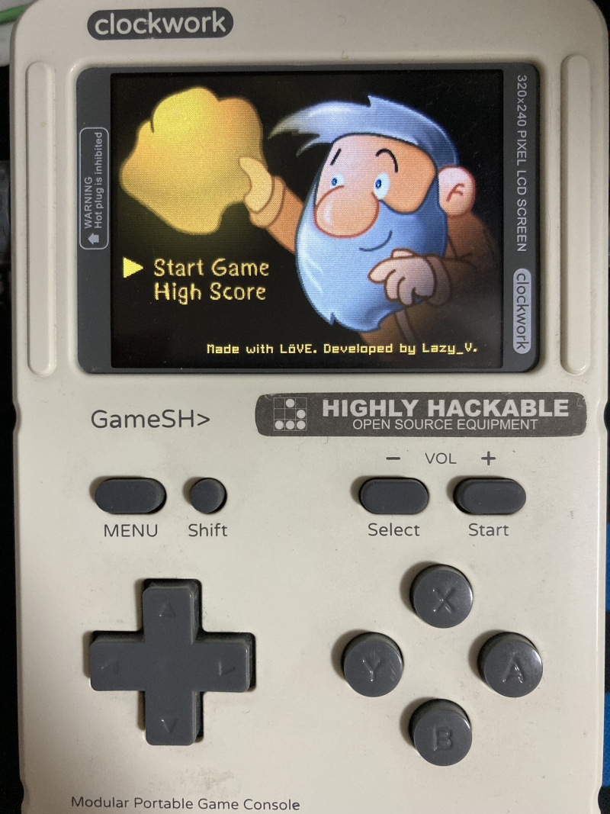
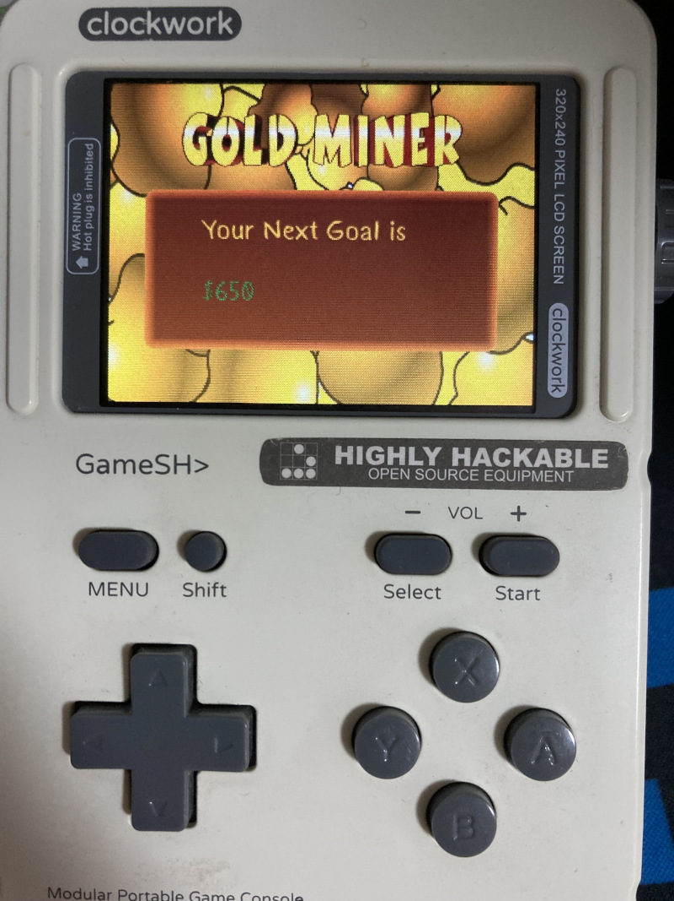
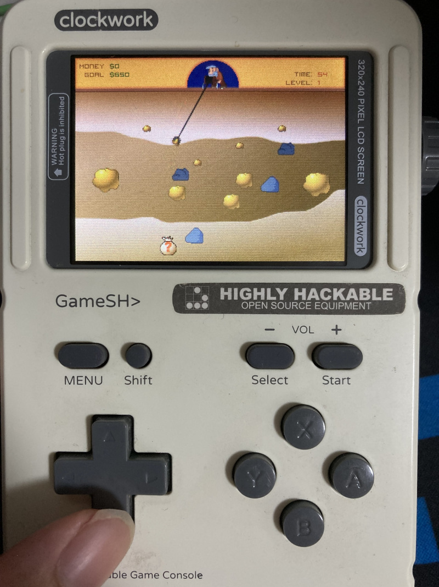

# GoldMiner-GameShell

The classic game remake. Build for GameShell. Made with [LÖVE](https://love2d.org/)(11.1).

The project uses [hump](https://github.com/vrld/hump) for utility functions. 

The project is in demo stage.

## How to play

Menu button -> Exit

A Button or Start Button -> Menu Confirm

A Button or Down -> Grab

Select Button -> Exit current level when you reach goal

## Screenshots

## Pictures

## TODO-List

- [ ] More levels
- [ ] More map entity types
- [ ] Shop system
- [ ] Props system
- [ ] High score system
- [ ] Continue game system (aka. Persistent system)

## License

This project's codes are licensed under the [MIT](./LICENSE) license.

Origin assets are from Internet, I modified them.