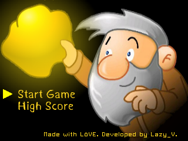

# GoldMiner-GameShell

The classic game remake. Build for GameShell. Made with [LÖVE](https://love2d.org/)(11.1).

The project uses [hump](https://github.com/vrld/hump) for utility functions. 

The project is in demo stage.

## How to play

Menu button -> Exit

A button or Start button -> Menu Confirm or Buy

Y button or Up -> Use dynamite

A button or Down -> Grab

Select Button -> Exit current level when you reach goal or Confirm shopping

Left and Right -> Select the shop item you wanna buy

## Screenshots

## Photos

## Release Notes

2022/5/24 DEMO-3:

- Added FXs.
- Added Strength! effect.
- Added miner animation
- Fixed #1
- Numerical balance adjustment

2022/5/23 DEMO-2: 

- Added new map entity: Diamond.
- Added new systems: Shop system, Props system.
- Added new levels: level-2 and level-3.
- Fixed some bugs.

## TODO-List

- [x] More levels
- [x] More map entity types
- [x] Shop system
- [x] Props system
- [ ] High score system
- [ ] Continue game system (aka. Persistent system)
- [ ] All levels
- [x] Numerical balance adjustment

## License

This project's codes are licensed under the [MIT](./LICENSE) license.

Origin assets are from Internet, I modified them.